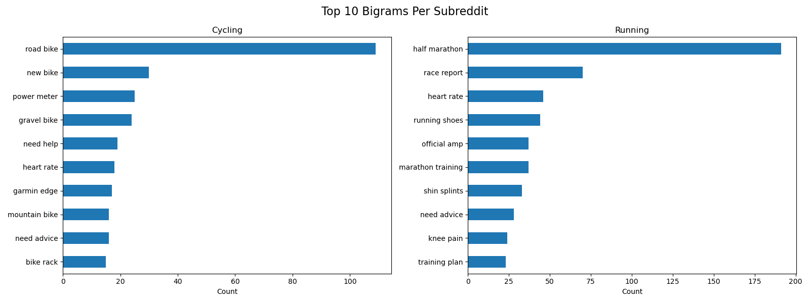

# Project 3 - Classification Modeling  for Reddit: Cycling v. Running

## Table of Contents
- [Problem Statement](#Problem-Statement)
- [Data Dictionary](#Data-Dictionary)
- [Data Selection and Cleaning](#Data-Selection-and-Cleaning)
- [Preliminary EDA](#Preliminary-EDA)
- [Natural Language Processing (NLP) and More EDA](#Natural-Language-Processing-(NLP)-and-More-EDA)
- [Preliminary EDA](#Preliminary-EDA)
- [Modelling Analysis](#Modelling-Analysis)
- [Conclusion and Recommendations](#Conclusion-and-Recommendations)

## Problem Statement

VitalStride is a fitness-tracking company that specializes in using exercise data to connect athletes together and to build a platform for healthy competition by monitoring performance metrics and hosting challenges. As a data scientist working for this company, I am tasked with utilizing Reddit, a popular online social aggregator, to build classification models between two distinct sub-communities (subreddits) of the two most popular tracked sports: cycling and running. In order to better understand customer needs, I will be using these classification models to distinguish and categorize a post between the two subreddits. From this, I hope to gather insights which can support the company's future R&D into potential avenues of improving its products and services, which are crucial for increasing profits and influence in this fast-moving market sector.

## Data Dictionary
|Feature|Type|Description|
|---|---|---|
|subreddit|object|The subreddit where we are scraping the data from.| 
|title|object|The title of an individual subreddit post.| 
|created_utc|float|The time that each post was created, converted to Unix epoch.| 
|title_length|int|The length of characters of the title of a post.|
|title_word_count|int|The total word count of the title of a post.|

## Data Selection and Cleaning
I will be using Pushshift to scrape the information listed in the data dictionary above. I will be only using the titles of every post because the 'running' subreddit has a atypical implementation such that every post's body text (self-text) is displayed as an image, and therefore unscrapable. This may affect the quality and variety of my data later on, but it is beneficial because I do not have to handle any nulls. For each subreddit, I created a dataframe from the scraped data. Additionally, I combined the dataframes to create a third 'combined' dataframe. Upon checking for duplicates, there was only one duplicate in the cycling subreddit, which I removed from both the combined and cycling dataframes. 

## Preliminary EDA
- I created two new columns, Title Length and Title Word Count, and analyzed the distributions per each subreddit.

**Initial Observations**
- Both of the distributions seem to be asymmetrical and skewed right, so they have a mean greater than the median. There are a lot of posts with smaller lengths and counts, but some very large posts.

- Between the two subreddits, /r/running does have a slightly higher average title length and title word count.

## Natural Language Processing (NLP) and More EDA

- It seems that /r/cycling is more focused on posts for upgrades on gear, hence the words like 'vs.', 'new', 'best', which all suggest comparisons. The running subreddit seems more focused on individual performance, with words like 'marathon', 'training', 'race', and 'pain'. 

- With the bigrams, or consecutive words, the distributions seem to confirm that /r/cycling is more focused on equipment upgrades, with  bigrams like 'new bike', 'power meter', 'garmin edge' (a bike computer) and 'bike rack.' Running seems to be more talkative about individual performance with bigrams like 'half marathon', 'race report', 'shin splints', 'knee pain', and 'training plan.' In fact, the only thing that stands out from the rest is 'running shoes.'

# Modelling Analysis
After processing the text data, I built four different classification models in a pipeline with CountVectorizer: Logistic Regression, Random Forest, Bagging, and AdaBoost. I used stop-words from the WordNetLemmatizer and set the tokenizer to the lemmatizer. I then built a simple but effective model evaluation function that prints each model's precision, recall, f1-score, and accuracy. I created a Confusion Matrix for each model.

---
&nbsp; 

<h3>Model Performance Summary</h3>

|**Model Name**|Recall|Precision|F1|Accuracy|
|---|---|---|---|---|
|Logistic Regression|0.8958|0.8775|0.8865|0.8827|
|Random Forest|0.9362|0.8207|0.8747|0.8653|
|Bagging|0.8294|0.8997|0.8631|0.8653|
|AdaBoost|0.8294|0.8997|0.8631|0.8653|

&nbsp; 

- Out of the four models, the **logistic regression** did the best in accuracy, and was also the most balanced model.
- Random Forest did quite stellar in recall with a 93.6% score. This would be good for predicting whether a post belongs to /r/cycling, and would be a good tool in the future for cycling-only related searching.
- It's interesting to see that the ensemble methods Bagging and AdaBoost had basically the exact same rounded metric scores. I think it's because of the lack of diversity in my dataset as well my hyperparameters.

## Conclusion and Recommendations
In this project, the highest performing classification model of the four chosen was **Logistic Regression** with an accuracy score of **88.2%**. Overall, this score is good, but not as high as I would have hoped for. The other three models trail in performance, but not too far. From our initial exploratory analysis, we found that /r/cycling has posts that tended to focus more on equipment and upgrades. /r/Running, on the other hand, focused more on individual performance. The ensemble models had the exact same rounded metric scores, which highlight that our dataset does not have enough variety in features or hyperparameters. In the future, I hope to use a more varied dataset, with greater feature engineering and distinct hyperparameters to help combat this. Additionally, adding more specific stopwords would be helpful in removing unnecessary noise from the dataset. While I did not use it, sentimental analysis could help in separating posts by emotion. Future models also should find a way to incorporate the subreddit body text and comments, despite its current implementation that seemingly prevents so.

